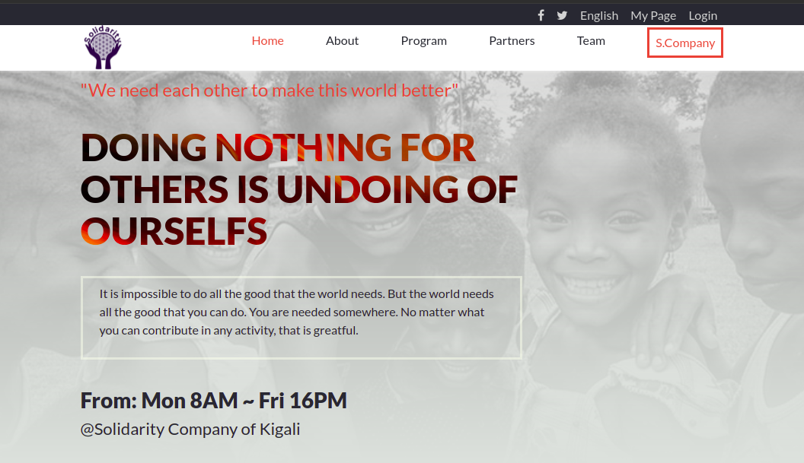

# # Solidarity Up !

## Description

## Here, are: 

Mobile version | Desktop
---------------------- | ------------------------------
 | 

> Solidarity Up is a web page of simple facts that would be better to be practiced in the aim of making our world better. 

> These are objectives of the project:
- Make people aware of helping others
- Remind everyone to understand their value in society
- Understand that you can help others regardless of the field

## Built With

- HTML
- CSS
- JavaScript
- Boostrap

## Get Started

To get a local copy up and running follow these simple example steps.

1. Clone the Repo or Download the Zip file or ``` https://github.com/tresorsawasawa/Solidarity-Capstone-project.git```.
2. ``` cd /Solidarity-Capstone-project```
3. Open it with the live server

## Live Demo

See the live by clicking [Live Demo Link](https://tresorsawasawa.github.io/Solidarity-Capstone-project/)

## Authors

👤 **Author**

- GitHub: [@tresorsawasawa](https://github.com/tresorsawasawa)
- Twitter: [@tresorsawasawa](https://twitter.com/TresorSawasawa)
- LinkedIn: [Trésor Sawasawa](https://www.linkedin.com/in/tr%C3%A9sor-sawasawa-43745320b/)

## 🤝 Contributing

Contributions, issues, and feature requests are welcome!

Feel free to check the [issues page](../../issues/).

## Show your support

Give a ⭐️ if you like this project!

## Acknowledgments

- Design and inspiration by [Cindy Shin on Behance](https://www.behance.net/gallery/29845175/CC-Global-Summit-2015)
- Thanks to everyone who will get time to check this code and sugest any [issue](https://github.com/tresorsawasawa/MyPortfolio/issues) to improve the page.
- Thank you [Microverse](https://www.microverse.org/)

## 📝 License

This project is [MIT](./MIT.md) licensed.
